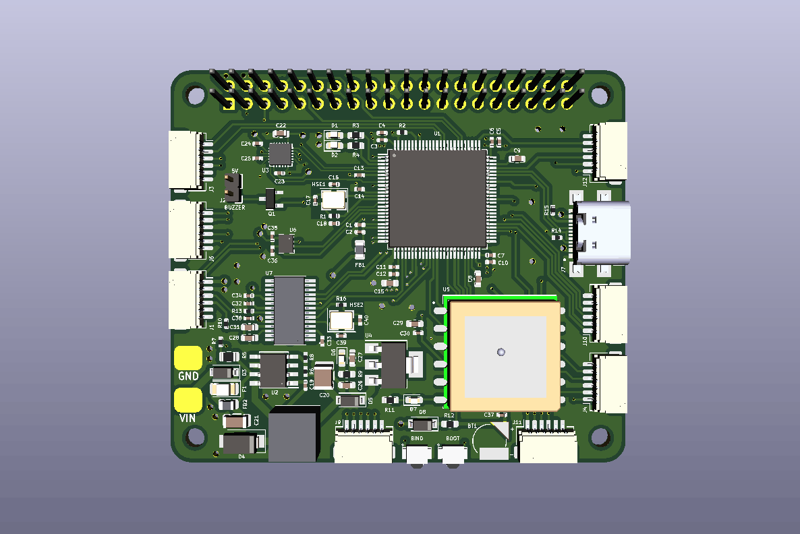

# FireFly 2
FireFly 2 is open source flight controller project compatible with BetaFlight and designated to be used with Raspberry Pi.

## Project goal
The idea of this project is to create flight controller which will use well developed software such as BetaFlight and connect it with higher level platform - Raspberry Pi. Betaflight was choosen for acomplishing best flying experience, and for managing all standard drone peripherals. The role of Raspberry Pi will be upgrading aircraft with additional vision algorithms, mission planing or even artificial inteligence. 

## Hardware
The heart of the board is STM32 H743 microcontroller with 2MB of flash and working speed up to 480MHz. This will ensure flight controller will be compatible with betaflight for long time. As gyroscope module ICM-20948 was chosen which is descendant of MPU9250. This device provides integrated 9-axis data fusion for achieving best positioning results. For power management TPS5450DDA was used which allows to connect power source with voltage up to 36V. As additional features, this board includes GPS and OSD modules as well as barometer. 
Main components:
1. Microcontroller STM32H743VIT6
2. IMU ICM-20948 (includes magnetometer)
3. Barometer BMP280
4. OSD module AT7456E
5. GPS module L80-M39
6. Step-down converter TPS5450DDA

## Connectors
For pin exposing SH connectors were chosen. It will ease soldering and protect board from damaging. List of available connections:
1. 8 dedicated PWM outputs for motor control
2. Dedicated buzzer pin
3. Dedicated UART2 port with 5V power pin for receiver
4. Video IN/OUT pins
5. USB-C connector
6. ADC pin for current meters (not included in board)
7. Spare I2C pins
8. Spare 2x UART pins
9. Spare SPI pins
10. Spare 3x PWM pins
11. STM32 debug pins